# Lightweight Agents Integrated Workflow

## Complete Multi-Agent Orchestration

```mermaid
graph TD
    Start([User Input: Compound/Disease]) --> Init["Initialize Agents<br/>DesignAgent()<br/>ADMETAgent()<br/>ControllerAgent()"]
    
    Init --> Controller["🎛️ Controller Agent<br/>(Orchestrator)"]
    
    Controller --> Loop{"should_continue()<br/>iteration < max?"}
    
    Loop -->|Yes| Design["🧪 Design Agent<br/>generate_molecule()<br/>OR<br/>search_compound()"]
    
    Design --> ValidateSmiles{"Valid SMILES?"}
    
    ValidateSmiles -->|No| SkipEval["Next iteration"]
    
    ValidateSmiles -->|Yes| ADMET["⚗️ ADMET Agent<br/>evaluate()<br/>predict_drug_likeness()<br/>get_admet_properties()"]
    
    ADMET --> Assessment{"Passes ADMET<br/>Filters?"}
    
    Assessment -->|Yes| Success["✅ record_success()<br/>log_success()"]
    
    Assessment -->|No| Failure["❌ record_failure()<br/>log_failure()"]
    
    Success --> UpdateProgress["update_progress()<br/>next_iteration()"]
    
    Failure --> UpdateProgress
    
    SkipEval --> UpdateProgress
    
    UpdateProgress --> TrackStats["📊 Track Progress<br/>get_progress()<br/>get_success_rate()"]
    
    TrackStats --> Loop
    
    Loop -->|No| Analysis["📈 Final Analysis<br/>get_top_successes()<br/>get_analysis_summary()"]
    
    Analysis --> Persistence["💾 Persist Results<br/>save_memory()<br/>export_memory()"]
    
    Persistence --> End([🎉 Results & Memory<br/>JSON Export])
    
    style Init fill:#e1f5ff
    style Controller fill:#fff3e0
    style Design fill:#f3e5f5
    style ADMET fill:#e8f5e9
    style Success fill:#c8e6c9
    style Failure fill:#ffcdd2
    style Analysis fill:#fce4ec
    style Persistence fill:#e0f2f1
    style End fill:#f1f8e9
```



## Agent Responsibilities & Methods

### 🧪 DesignAgent (Molecule Generation & Analysis)
- **`run(compound)`** - Main compound analysis pipeline
- **`generate_molecule()`** - Create new molecules
- **`search_compound(smiles_or_name)`** - Search in databases
- **`filter_by_status(status)`** - Filter analyzed compounds
- **`log_success(smiles, score)`** - Record successful compounds
- **`log_failure(smiles, reason)`** - Record rejected compounds
- **`get_stats()`** - Return analysis statistics
- **`get_analysis_summary()`** - Comprehensive results summary
- **`get_top_successes(n)`** - Get best compounds
- **`save_memory() / load_memory()`** - Persist data to JSON
- **`export_memory(filepath)`** - Export to external file

### ⚗️ ADMETAgent (Property Evaluation)
- **`get_admet_properties(smiles)`** - Predict absorption, distribution, metabolism, excretion, toxicity
- **`predict_drug_likeness(smiles)`** - Lipinski's rule of five assessment
- **`predict_toxicity(smiles)`** - Identify toxic substructures
- **`evaluate(smiles)`** - Single compound pass/fail evaluation
- **`batch_evaluate(smiles_list)`** - Evaluate multiple compounds
- **`filter_compounds(smiles_list)`** - Filter by ADMET criteria
- **`compare_compounds(smiles1, smiles2)`** - Comparative analysis
- **`get_pass_rate()`** - Success rate metrics
- **`get_evaluation_criteria()`** - Active filter thresholds

### 🎛️ ControllerAgent (Workflow Orchestration)
- **`record_success(smiles)`** - Register successful compound
- **`record_failure(smiles, reason)`** - Register failed compound
- **`should_continue(iteration, success_count)`** - Loop control logic
- **`next_iteration()`** - Increment iteration counter
- **`has_reached_target()`** - Check if goal achieved
- **`get_progress()`** - Current iteration/success metrics
- **`get_success_rate()`** - Calculate pass rate
- **`estimate_completion()`** - Estimated iterations remaining

## Data Flow

```mermaid
graph LR
    Input["📥 Input<br/>SMILES/Name"]
    
    Input --> Design["Design Agent<br/>Memory"]
    
    Design -->|SMILES| ADMET["ADMET Agent<br/>Properties"]
    
    ADMET -->|Pass/Fail| Controller["Controller<br/>Progress"]
    
    Controller -->|Continue?| Design
    
    Design -->|Final| Export["💾 JSON Export<br/>Success List<br/>Statistics"]
    
    style Input fill:#e3f2fd
    style Design fill:#f3e5f5
    style ADMET fill:#e8f5e9
    style Controller fill:#fff3e0
    style Export fill:#f1f8e9
```



## Integration Points

```mermaid
graph TD
    subgraph Agents["🤖 Lightweight Agents (No Heavy Deps)"]
        DesignA["DesignAgent"]
        ADMETA["ADMETAgent"]
        ControllerA["ControllerAgent"]
    end
    
    subgraph Optional["🔧 Optional Tools (Lazy-Loaded)"]
        PubChem["PubChem API"]
        QSAR["QSAR Models"]
        Docking["Docking Engine"]
    end
    
    subgraph Persistence["💾 Data Storage"]
        JSONMem["JSON Memory"]
        Export["File Export"]
    end
    
    subgraph Analytics["📊 Monitoring"]
        Stats["Statistics"]
        Reporting["Progress Reports"]
    end
    
    DesignA --> JSONMem
    ADMETA --> Stats
    ControllerA --> Reporting
    
    DesignA -.->|Optional| PubChem
    ADMETA -.->|Optional| QSAR
    DesignA -.->|Optional| Docking
    
    JSONMem --> Export
    Stats --> Reporting
    
    style Agents fill:#e3f2fd,stroke:#1976d2,stroke-width:2px
    style Optional fill:#fff9c4,stroke:#f9a825,stroke-width:1px
    style Persistence fill:#c8e6c9,stroke:#388e3c
    style Analytics fill:#fce4ec,stroke:#c2185b
```



## Memory Structure

```mermaid
graph TD
    Memory["Agent Memory<br/>JSON Format"]
    
    Memory --> Successes["📋 Successes<br/>- SMILES<br/>- Score<br/>- Timestamp"]
    
    Memory --> Failures["📋 Failures<br/>- SMILES<br/>- Reason<br/>- Timestamp"]
    
    Memory --> Analyzed["📋 Analyzed<br/>List of all SMILES"]
    
    Memory --> Counter["📊 Generation Count<br/>Total processed"]
    
    Successes --> Export["💾 Export"]
    Failures --> Export
    Analyzed --> Export
    Counter --> Export
    
    style Memory fill:#e8f5e9
    style Successes fill:#c8e6c9
    style Failures fill:#ffcdd2
    style Analyzed fill:#b3e5fc
    style Counter fill:#fff9c4
    style Export fill:#f1f8e9
```



## Example Workflow Execution

```mermaid
sequenceDiagram
    participant User
    participant Controller
    participant Design
    participant ADMET
    participant Memory
    
    User->>Controller: initialize(target=10)
    User->>Design: load previous memory
    Design->>Memory: ✓ Memory loaded
    
    loop Iteration Loop
        Controller->>Controller: should_continue()?
        alt Iteration < Max
            Controller->>Design: generate_molecule()
            Design->>Design: ✓ SMILES = "CC(=O)Oc1..."
            Design->>ADMET: evaluate(SMILES)
            ADMET->>ADMET: check ADMET properties
            alt Passes Filters
                ADMET-->>Design: ✓ Pass
                Design->>Memory: log_success(SMILES)
                Controller->>Controller: record_success()
            else Fails Filters
                ADMET-->>Design: ✗ Fail
                Design->>Memory: log_failure(SMILES, reason)
                Controller->>Controller: record_failure()
            end
            Controller->>Controller: next_iteration()
        else Target Reached
            break Exit Loop
            end
        end
    end
    
    Controller->>Design: get_top_successes(n=5)
    Design->>User: ✓ Results
    Design->>Memory: save_memory()
    Memory->>User: ✓ Results exported
```



## Performance Characteristics

- **Startup Time**: < 1ms (instant, no heavy imports)
- **Single Evaluation**: ~1-5ms (SMILES validation only)
- **Batch Processing**: 100 compounds in < 100ms
- **Memory Overhead**: ~1MB per 1000 compounds analyzed
- **Scalability**: No dependencies on external services by default

## Quick Start Integration

```python
from agents.design_agent.agent import DesignAgent
from agents.admet_agent.agent import ADMETAgent
from agents.controller_agent.agent import ControllerAgent

# Initialize (instant, no heavy deps)
design = DesignAgent(use_tools=False)
admet = ADMETAgent(use_tools=False)
controller = ControllerAgent(goals={"target": 10})

# Main loop
while controller.should_continue(controller.iteration_count, controller.success_count):
    smiles = design.generate_molecule()
    if admet.evaluate(smiles):
        controller.record_success()
        design.log_success(smiles)
    else:
        controller.record_failure()
        design.log_failure(smiles, "ADMET veto")
    controller.next_iteration()

# Results
results = design.get_analysis_summary()
design.save_memory()
```

---

For complete API documentation, see [AGENTS_API.md](AGENTS_API.md)  
For working examples, see [agents_examples.py](agents_examples.py)  
For quick reference, see [AGENTS_QUICK_REFERENCE.py](AGENTS_QUICK_REFERENCE.py)
