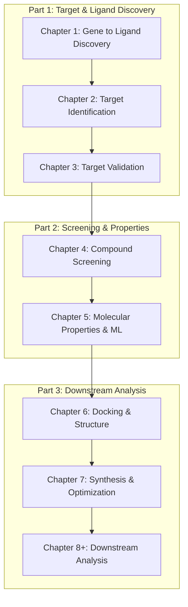

This diagram shows the sequential flow and linkage between all major parts and chapters in your drug discovery workflow. Outputs from each chapter become the inputs for the next, forming a reproducible pipeline.