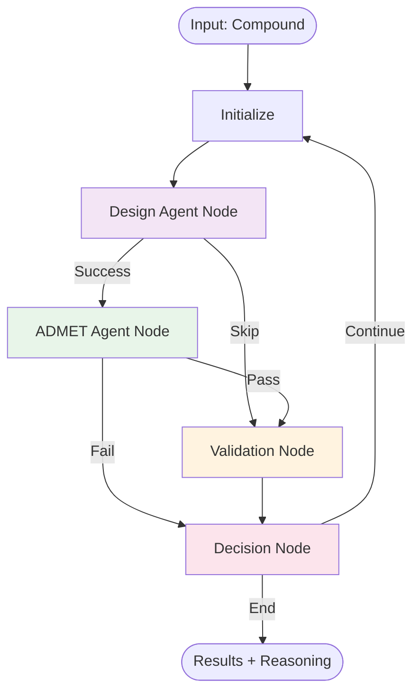

# LangGraph Integration for Drug Discovery AI

## Overview

This project now includes **LangGraph-based agents** with advanced reasoning capabilities, replacing simple sequential workflows with graph-based state machines featuring:

- ✅ **ReAct Reasoning** - Transparent Thought → Action → Observation → Reflection patterns
- ✅ **Conditional Routing** - Dynamic flow based on results
- ✅ **State Checkpointing** - Resume workflows and maintain audit trails
- ✅ **Graph Orchestration** - Node-based architecture with flexible routing

---

## Architecture

### State Schema

```python
class AgentState(TypedDict):
    # Input
    compound: str
    smiles: Optional[str]
    
    # Reasoning traces
    messages: List[BaseMessage]
    
    # Results from each agent
    design_result: Optional[Dict]
    admet_result: Optional[Dict]
    validation_result: Optional[Dict]
    
    # Workflow control
    iteration: int
    success_count: int
    failure_count: int
    
    # Final output
    final_decision: Optional[str]
    confidence_score: Optional[float]
```

### Graph Structure



---

## ReAct Reasoning Pattern

Each node implements the ReAct (Reasoning + Acting) pattern:

### 1. **THOUGHT** 💭
```
"I need to analyze aspirin. First, I'll design and evaluate its properties."
```

### 2. **ACTION** 🎯
```
"ACTION: design_agent.run with params {'compound': 'aspirin'}"
```

### 3. **OBSERVATION** 👁️
```
"OBSERVATION: Design analysis complete. Status: completed"
```

### 4. **REFLECTION** 🤔
```
"REFLECTION: Design looks promising. Proceeding to ADMET evaluation."
```

This creates a **transparent audit trail** of all decisions made by the AI.

---

## Installation

```bash
# Install LangGraph and dependencies
pip install langgraph langchain-core langchain-openai

# Or install all requirements
pip install -r requirements.txt
```

---

## Quick Start

### Basic Usage

```python
from agents.langgraph_agents import LangGraphDrugDiscoveryAgent

# Initialize agent
agent = LangGraphDrugDiscoveryAgent(
    max_iterations=10,
    target_successes=5
)

# Analyze compound
result = agent.analyze_compound(
    compound="aspirin",
    smiles="CC(=O)Oc1ccccc1C(=O)O"
)

# Get reasoning trace
reasoning_trace = agent.get_reasoning_trace(result)
for step in reasoning_trace:
    print(step)

# Export results
agent.export_results(result, "aspirin_analysis.json")
```

### Run Examples

```bash
# Example 1: Basic analysis with reasoning
python langgraph_examples.py 1

# Example 2: Multi-compound workflow
python langgraph_examples.py 2

# Example 3: Export reasoning traces
python langgraph_examples.py 3

# Example 4: Conditional routing demo
python langgraph_examples.py 4

# Example 5: Checkpointing demo
python langgraph_examples.py 5

# Run all examples
python langgraph_examples.py all
```

---

## Key Features

### 1. **Graph-Based Orchestration**

Instead of simple loops:
```python
# Old approach
while iteration < max_iterations:
    design_result = design_agent.run(compound)
    admet_result = admet_agent.evaluate(smiles)
    # ...
```

LangGraph uses a **state machine**:
```python
# New approach - nodes and edges
workflow = StateGraph(AgentState)
workflow.add_node("design", design_agent_node)
workflow.add_node("admet", admet_agent_node)
workflow.add_conditional_edges("design", route_after_design)
```

### 2. **Conditional Routing**

Routes dynamically based on results:
```python
def route_after_design(state: AgentState) -> str:
    """Route based on design results"""
    if state["design_result"]["status"] == "completed":
        return "admet"  # Continue to ADMET
    else:
        return "validate"  # Skip to validation
```

### 3. **State Checkpointing**

```python
# Automatic checkpointing at each node
memory = MemorySaver()
graph = workflow.compile(checkpointer=memory)

# Resume from any checkpoint
config = {"configurable": {"thread_id": "my_thread"}}
graph.stream(initial_state, config)
```

### 4. **Transparent Reasoning**

Every decision includes:
- **Thought**: What the agent is thinking
- **Action**: What it decides to do
- **Observation**: What happened
- **Reflection**: What it learned

```json
{
  "reasoning_trace": [
    "💭 THOUGHT: Analyzing aspirin. I'll check molecular properties.",
    "🎯 ACTION: design_agent.run with params {'compound': 'aspirin'}",
    "👁️ OBSERVATION: Design analysis complete. Status: completed",
    "🤔 REFLECTION: Design looks promising. Proceeding to ADMET."
  ]
}
```

---

## API Reference

### `LangGraphDrugDiscoveryAgent`

**Constructor:**
```python
agent = LangGraphDrugDiscoveryAgent(
    max_iterations: int = 10,      # Maximum workflow iterations
    target_successes: int = 5       # Target number of successful compounds
)
```

**Methods:**

#### `analyze_compound(compound, smiles=None)`
Analyze a single compound using the graph workflow.

**Returns:** Final state with complete reasoning trace

```python
result = agent.analyze_compound("aspirin", smiles="CC(=O)Oc1ccccc1C(=O)O")
```

#### `get_reasoning_trace(state)`
Extract reasoning trace from state.

**Returns:** List of reasoning steps

```python
traces = agent.get_reasoning_trace(result)
```

#### `export_results(state, filepath)`
Export results to JSON file.

```python
agent.export_results(result, "results.json")
```

---

## Graph Nodes

### 1. **Initialize Node**
- Sets up workflow
- Adds system messages
- Initializes reasoning

### 2. **Design Agent Node**
- Analyzes compound structure
- Uses ReAct reasoning
- Routes to ADMET or validation

### 3. **ADMET Agent Node**
- Evaluates drug-likeness
- Checks toxicity
- Records pass/fail

### 4. **Validation Node**
- Combines all results
- Makes final decision
- Calculates confidence

### 5. **Decision Node**
- Checks stopping criteria
- Decides to continue or end
- Updates iteration count

---

## Comparison: Before vs After

| Feature | Before (Simple Agents) | After (LangGraph) |
|---------|----------------------|-------------------|
| Orchestration | Sequential loops | Graph state machine |
| Reasoning | Implicit | Explicit ReAct traces |
| Routing | Fixed flow | Conditional edges |
| State | No persistence | Checkpointing enabled |
| Debugging | Print statements | Full audit trail |
| Resume | Not possible | Resume from checkpoints |
| Complexity | Simple | Advanced |
| Transparency | Low | High |

---

## Integration with Existing Agents

LangGraph agents **wrap your existing lightweight agents**:

```python
# Your existing agents still work
from agents.design_agent.agent import DesignAgent
from agents.admet_agent.agent import ADMETAgent

# LangGraph uses them internally
def design_agent_node(state: AgentState):
    agent = DesignAgent(use_tools=False)
    result = agent.run(state["compound"])
    # ... add reasoning traces
    return updated_state
```

**Both systems coexist:**
- Use lightweight agents for simple workflows
- Use LangGraph agents for complex reasoning needs

---

## Example Output

```
==================================================================
LangGraph Drug Discovery Agent - ReAct Reasoning Demo
==================================================================

🔬 Analyzing compound: aspirin

==================================================================
REASONING TRACE
==================================================================
1. 💭 THOUGHT: I need to analyze aspirin. First, I'll design and evaluate its properties.
2. 🎯 ACTION: design_agent.run with params {'compound': 'aspirin'}
3. 👁️ OBSERVATION: Design analysis complete. Status: completed
4. 🤔 REFLECTION: Design looks promising. Proceeding to ADMET evaluation.
5. 💭 THOUGHT: Evaluating ADMET properties for aspirin. Checking drug-likeness and toxicity.
6. 🎯 ACTION: admet_agent.evaluate with params {'smiles': 'CC(=O)Oc1ccccc1C(=O)O'}
7. 👁️ OBSERVATION: ADMET evaluation: PASS. Properties: {...}
8. 🤔 REFLECTION: ADMET properties acceptable. Compound is viable for further validation.
9. 💭 THOUGHT: Validating all results for aspirin. Combining design and ADMET outcomes.
10. 🎯 ACTION: validate_compound with params {...}
11. 👁️ OBSERVATION: Validation complete. Overall: PASS
12. 🤔 REFLECTION: ✅ aspirin validated successfully! Adding to successful compounds.
13. 💭 THOUGHT: Current status: 1/1 successes, iteration 1/10
14. 🤔 REFLECTION: 🎉 Target reached! Found 1 successful compounds.

==================================================================
FINAL RESULTS
==================================================================
Compound: aspirin
Decision: APPROVED
Confidence: 90.00%
Iterations: 1

✅ Results exported to: /tmp/langgraph_drug_discovery_results.json
```

---

## Files Added

- **`agents/langgraph_agents.py`** (650+ lines) - Main LangGraph implementation
- **`langgraph_examples.py`** (280+ lines) - 5 working examples
- **`LANGGRAPH_README.md`** (This file) - Complete documentation
- **Updated `requirements.txt`** - Added langgraph dependencies

---

## Next Steps

1. **Install dependencies**: `pip install -r requirements.txt`
2. **Run examples**: `python langgraph_examples.py all`
3. **Integrate with your workflow**: Import `LangGraphDrugDiscoveryAgent`
4. **Customize nodes**: Add your own agent nodes to the graph
5. **Add tools**: Integrate external tools with LangChain tool interface

---

## Troubleshooting

### Import Error
```bash
pip install langgraph langchain-core langchain-openai
```

### Graph Not Compiling
Check that all nodes are added before setting edges:
```python
workflow.add_node("name", function)  # Add nodes first
workflow.add_edge("start", "end")     # Then add edges
```

### State Not Updating
Ensure nodes return updated state dictionaries:
```python
def my_node(state: AgentState) -> AgentState:
    return {**state, "field": "value"}  # Spread and update
```

---

## Resources

- **LangGraph Docs**: https://langchain-ai.github.io/langgraph/
- **ReAct Paper**: https://arxiv.org/abs/2210.03629
- **LangChain**: https://python.langchain.com/

---

For questions or issues, see the main [README.md](README.md) or open an issue on GitHub.
