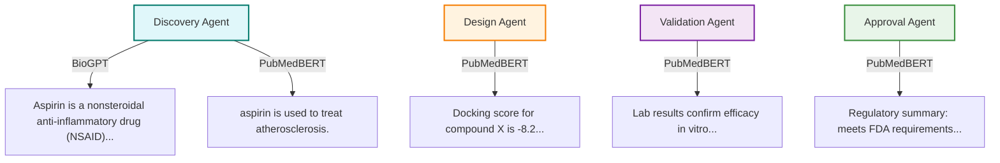

# Drug Discovery AI Assistant

## 🚀 Project Overview
An end-to-end, modular AI system for drug discovery, integrating biomedical databases, multi-agent orchestration, and domain-specific LLMs. Designed for automation, extensibility, and real-world research impact.

---

## 🧑‍💻 My Contributions
- Designed and implemented the modular, multi-agent architecture (Discovery, Design, Validation, Approval).
- Integrated real-world biomedical data sources (PubMed, PubChem, AlphaFold) and tools.
- Developed API (FastAPI) and web UI (Streamlit) for interactive and programmatic access.
- Leveraged domain-specific LLMs (BioGPT, PubMedBERT, BioBERT) for summarization and knowledge extraction.
- Wrote robust, extensible Python code with clear documentation and error handling.

---

## 🛠️ Technologies Used
- **Python** (3.10+)
- **FastAPI** (API backend)
- **Streamlit** (web UI)
- **LangChain, CrewAI** (agent orchestration)
- **MongoDB** (vector/document storage)
- **Hugging Face Transformers** (BioGPT, PubMedBERT, BioBERT)
- **Docker** (optional, for deployment)

---

## 📈 Example Outputs

**API Example:**
```bash
curl "http://127.0.0.1:8000/full_workflow?query=BACE1"
```
Sample response:
```json
{
	"discovery": {"literature": ["40886227", ...], "structure": "AlphaFold structure ...", ...},
	"design": {"compound_info": { ... }, ...},
	"validation": {"lab_result": "...", ...},
	"approval": {"approval_report": "...", ...}
}
```

**Web UI:**


---

## 📓 Quickstart Notebook

See [`notebooks/demo_workflow.ipynb`](notebooks/demo_workflow.ipynb) for a step-by-step demo of the pipeline (API calls, outputs, and explanations).

---

## ⚙️ Usage Instructions

**1. Install dependencies:**
```bash
pip install -r requirements.txt
```

**2. Start the API:**
```bash
uvicorn app.example_main:app --reload
```

**3. (Optional) Start the Streamlit frontend:**
```bash
streamlit run frontend.py
```

**4. Try the API:**
```bash
curl "http://127.0.0.1:8000/full_workflow?query=aspirin"
```

---

## 💡 Project Motivation & Impact
This project demonstrates how modern AI and LLMs can automate and accelerate drug discovery by integrating literature, compound, and structure data. It showcases skills in software engineering, biomedical data integration, and applied AI—making it a strong portfolio piece for computational drug discovery roles.

---

## 🌱 Future Work / Stretch Goals
- Add more ML/DL modeling (e.g., biomarker → drug response prediction)
- Expand ETL pipelines for omics/clinical data
- Integrate experiment tracking (MLflow)
- Deploy with Docker for reproducibility
- Write a LinkedIn/Medium post about the project

---

## Biomedical Models Used

- **BioGPT**: Microsoft’s biomedical language model, trained on PubMed and biomedical text. Excellent for drug/life sciences tasks, and highly recommended for biomedical text generation, summarization, and question answering.
- **PubMedBERT**: Biomedical BERT model, trained on PubMed abstracts and full text. Ideal for extracting biomedical knowledge, masked word prediction, and summarization of scientific literature.
- **BioBERT**: Biomedical BERT variant, also trained on PubMed and PMC articles. Used for protein/gene target summarization and biomedical fill-mask tasks.

> **Note:** All models are loaded via Hugging Face Transformers and run locally. No Ollama or general LLMs are required.

**When to use these models:**
- Use **BioGPT**, **PubMedBERT**, or **BioBERT** for all drug discovery, pharmaceutical, or life sciences tasks (e.g., drug properties, disease mechanisms, literature summarization, biomedical Q&A).
- These models are trained on domain-specific corpora (PubMed, biomedical literature), so they produce more accurate, relevant, and trustworthy results for scientific and medical queries than general LLMs.

See the `tools/biobert_tool.py` and `tools/pubmedbert_tool.py` for usage examples.


# Agent Enhancements (August 2025)

All core agents (Discovery, Design, Validation, Approval) have been modernized and enhanced:

- Integrated real data sources and tools for each agent (PubMed, PubChem, AlphaFold, Docking, QSAR, Lab, Clinical, Regulatory).
- Added biomedical LLM summarization to every agent using BioGPT, PubMedBERT, or BioBERT.
- Prompts are now readable, context-rich, and tailored to each agent's domain (compound info, literature, docking, QSAR, lab, clinical, regulatory, etc.).
- Summarization is performed using domain-specific models for high-quality, relevant responses.
- Exception handling is robust and specific.
- Code is modular, maintainable, and ready for further extension.


# Recent Enhancements (August 2025)

The drug discovery AI workflow has been significantly improved:

- Integrated real PubMed, PubChem, and AlphaFold tools for literature, compound, and structure data.
- All summarization and knowledge extraction now use biomedical-specific models (BioGPT, PubMedBERT, BioBERT).
- Prompts and fill-mask tasks are tailored for biomedical context and accuracy.
- Exception handling is more robust and specific.
- Code is modular, maintainable, and ready for further extension.

## 🔬 New Features: PubChem Target-to-Compound Lookup & Multi-Compound Analysis (August 2025)

- **Target-to-Compound Lookup:**
	- The DiscoveryAgent now performs a real-time lookup of compounds associated with a given target using the PubChem REST API.
	- When you enter a target (e.g., "BACE1"), the system fetches a list of relevant compounds from PubChem and displays them in the output as `compounds_for_target`.
	- This enables a true target-to-compound workflow, bridging the gap between target identification and compound design.

- **Multi-Compound Analysis:**
	- The DesignAgent now accepts and analyzes multiple compounds per target.
	- When a list of compounds is returned by the DiscoveryAgent, the DesignAgent will evaluate each one (e.g., docking, QSAR, etc.) and return results for all.
	- This allows for broader exploration and comparison of candidate compounds.

- **Streamlit Frontend Improvements:**
	- The web UI now displays all workflow steps and persists outputs for each section using `st.session_state`.
	- User input is validated to ensure correct entry of disease, target, or compound at each step.
	- The compounds found for a target are clearly displayed and can be used as input for the design step.

**Example Output (DiscoveryAgent with PubChem integration):**
```json
{
	"literature": ["40886227", ...],
	"structure": "AlphaFold structure for BACE1 found.",
	"compounds_for_target": ["CID1234", "CID5678", "CID91011"],
	"llm_summary": "BACE1 is a key target in Alzheimer's disease..."
}
```

**Example Output (DesignAgent with multi-compound analysis):**
```json
{
	"compound_results": {
		"CID1234": {"docking_score": -8.2, ...},
		"CID5678": {"docking_score": -7.9, ...},
		...
	}
}
```

See the updated Streamlit UI (`frontend.py`) for a more interactive and persistent workflow experience.

## 🧩 Modular Workflow

The following diagram shows the modular structure and workflow of the project:


* API Layer: Handles incoming requests and responses.
* Agent Layer: Orchestrates agent logic and task delegation.
* Tool Layer: Provides modular access to external data sources and AI models.
* Data Layer: Handles persistent and intermediate data storage.
* Utils: Shared utility functions used across modules.


# 🧠💊 Drug Discovery AI Assistant


## 🤖 System Overview: LLM RAG Agents & Multi-Agent Orchestration

This project is an end-to-end AI platform for accelerating pharmaceutical research, built on modular Retrieval-Augmented Generation (RAG) agents and a multi-agent workflow:

- **LLM RAG Agents:** Specialized agents combine large language model reasoning with real-time retrieval from biomedical databases (e.g., PubMed, PubChem), enabling up-to-date, context-aware answers for drug discovery tasks.
- **Multi-Agent Orchestration:** A custom orchestrator coordinates multiple agents, each handling a distinct stage of the workflow (e.g., literature search, compound design, validation, approval). Agents communicate and delegate tasks to maximize research efficiency.
- **Vector Database (MongoDB + VoyageAI):** Retrieved documents and embeddings are stored in MongoDB, with VoyageAI providing vector search for fast, relevant retrieval.
- **Production API (FastAPI):** The system exposes its capabilities via a FastAPI application, enabling programmatic access to the multi-agent workflow for integration with other tools or user interfaces.

**Workflow Overview:**
1. A user or API client submits a query (e.g., a compound name) to the FastAPI endpoint.
2. The orchestrator agent delegates subtasks to specialized RAG agents, which retrieve and synthesize information from external sources using modular tools.
3. Retrieved and generated data are embedded and stored in MongoDB for efficient future access.
4. The system returns a synthesized, context-rich response to the user.


## 🖼️ Example Workflow & LLM Outputs (Mermaid Diagram)



*This diagram shows each agent and the biomedical model used for summarization. All stages now use BioGPT, PubMedBERT, or BioBERT as appropriate.*

See `agents/multi_agent.py` and `app/main.py` for implementation details.

 *(record a short Loom/GIF later)*

An end-to-end AI system for accelerating pharmaceutical research, demonstrating:

✅ **LLM Orchestration** (LangChain/CrewAI)  
✅ **Vector RAG** (MongoDB + VoyageAI)  
✅ **Production API** (FastAPI/Pydantic)  
✅ **Multi-Agent Systems**  


## 🏗️ Architecture

The following diagram shows the updated high-level architecture of the Drug Discovery AI Assistant:


* User/API Client sends a request to the FastAPI app.
* The app orchestrates agents and tools.
* Each agent delegates to specialized tools for data retrieval and analysis.
* Tools fetch data from online databases or perform computations.
* All results and intermediate data are stored in MongoDB.

## 🧑‍🔬 Agent Descriptions & AI Methods

| Agent            | Description                                                                 | AI Methods/Models Used                |
|------------------|-----------------------------------------------------------------------------|--------------------------------------|
| Discovery Agent  | Searches biomedical literature and databases to identify potential drug candidates. | LLM (RAG), PubMed, PubChem           |
| Design Agent     | Designs and optimizes candidate compounds based on discovery results.             | LLM, AlphaFold, Docking, QSAR        |
| Validation Agent | Validates candidate compounds using lab and clinical data.                        | LLM, LabTool, ClinicalTool           |
| Approval Agent   | Assesses regulatory requirements and prepares documentation for approval.         | LLM, RegulatoryTool                  |

---

## 🚀 Quick Start
```bash
pip install -r requirements.txt
uvicorn app.example_main:app --reload
```

## 🛠️ API Endpoints

The FastAPI backend exposes the following endpoints (see `app/example_main.py`):

| Endpoint         | Method | Description                                                      | Example Query Param(s)         |
|------------------|--------|------------------------------------------------------------------|-------------------------------|
| `/discovery`     | GET    | Run DiscoveryAgent on a disease/target/compound                  | `?query=BACE1`                |
| `/design`        | GET    | Run DesignAgent on a compound                                    | `?compound=aspirin`           |
| `/validation`    | GET    | Run ValidationAgent on a candidate drug                          | `?candidate=aspirin`          |
| `/approval`      | GET    | Run ApprovalAgent on a candidate drug                            | `?candidate=aspirin`          |
| `/full_workflow` | GET    | Run the full workflow (Discovery → Design → Validation → Approval)| `?query=BACE1`                |

All endpoints return JSON responses. Use `/full_workflow` for an end-to-end pipeline, or call individual endpoints for stepwise control.
---

## 🏁 What Next?

Now that you have the Drug Discovery AI Assistant running locally, here are some suggested next steps:

- **Customize Agents:** Modify or extend the agent logic in `agents/` to add new tools, change prompts, or integrate additional data sources.
- **Integrate New Models:** Try other LLMs from Ollama or Hugging Face by updating the agent `model` parameter, or add your own domain-specific models.
- **Experiment with Prompts:** Tune the prompts for each agent to improve the quality and relevance of LLM outputs for your specific research needs.
- **Deploy the API:** Use FastAPI’s deployment options to run the system in production (e.g., with Docker, on a cloud VM, or behind a reverse proxy).
- **Connect a Frontend:** Build a web or desktop UI to interact with the API, visualize results, or manage workflows.
- **Scale Up:** Integrate with more advanced vector databases, distributed compute, or workflow orchestration tools for larger-scale research.
- **Contribute:** Open issues or pull requests to help improve the project, or share your use cases and feedback!


---


## 🌐 Simple Streamlit Frontend

You can interact with the Drug Discovery AI backend using a simple Streamlit web app. This provides an easy-to-use interface for entering queries and viewing results.

### Usage

1. Make sure your FastAPI backend is running (see Quick Start above).
2. Install Streamlit if you haven't already:
	```bash
	pip install streamlit
	```
3. Run the frontend:
	```bash
	streamlit run frontend.py
	```
4. Enter a disease, target, or compound in the web UI and view the results interactively.

The Streamlit app is located in `frontend.py`.


You can build a user-friendly frontend to interact with the Drug Discovery AI API. Here are some options and examples:

### 1. Simple Web Client (HTML/JS)

You can use a basic HTML/JavaScript page to send requests to the FastAPI backend:

```html
<form id="queryForm">
	<input type="text" id="query" placeholder="Enter compound name">
	<button type="submit">Submit</button>
</form>
<pre id="result"></pre>
<script>
document.getElementById('queryForm').onsubmit = async function(e) {
	e.preventDefault();
	const q = document.getElementById('query').value;
	const res = await fetch(`http://127.0.0.1:8000/full_workflow?query=${encodeURIComponent(q)}`);
	document.getElementById('result').textContent = await res.text();
};
</script>
```

### 2. Streamlit App (Python)

Create a simple Streamlit UI for local use:

```python
import streamlit as st
import requests

st.title("Drug Discovery AI Assistant")
query = st.text_input("Enter compound name:")
if st.button("Submit"):
		response = requests.get(f"http://127.0.0.1:8000/full_workflow?query={query}")
		st.write(response.text)
```

### 3. Advanced Web UI (React, Next.js, etc.)

For a modern, user-friendly experience, build a custom frontend using React, Next.js, or similar frameworks. Example (React fetch call):

```javascript
fetch('http://127.0.0.1:8000/full_workflow?query=BACE1')
	.then(res => res.json())
	.then(data => setResult(data));
```

You can design interactive dashboards, result visualizations, and workflow management features tailored to your needs.


---

## 🧪 Step-by-Step Example: Discovering a Drug Candidate

Here’s how you can use the Drug Discovery AI pipeline for a real-world drug discovery scenario:

**Goal:** Identify and evaluate new drug candidates for Alzheimer’s disease (target: BACE1)

### 1. Start the Backend API
```bash
uvicorn app.example_main:app --reload
```

### 2. Submit a Query (e.g., via browser or curl)
```bash
curl "http://127.0.0.1:8000/full_workflow?query=BACE1"
```
Or use the interactive docs at [http://127.0.0.1:8000/docs](http://127.0.0.1:8000/docs)

### 3. Review the Output
- **Discovery Agent:** Summarizes BACE1’s role in Alzheimer’s, retrieves relevant compounds and literature.
- **Design Agent:** Suggests and evaluates new compound designs, docking scores, and predicted properties.
- **Validation Agent:** Simulates lab/clinical validation, summarizes findings.
- **Approval Agent:** Generates a regulatory summary for the candidate.

### 4. Iterate and Refine
- Try different targets or compounds (e.g., "aspirin", "tau protein").
- Adjust agent prompts or models for more specific results.
- Integrate your own data or tools for deeper analysis.

### 5. (Optional) Build a Frontend
- Use the provided examples to create a web UI for easier interaction and visualization.


## 🧪 Step-by-Step Example Outputs

Here’s a real example showing the outputs at each step of the workflow for the query "Alzheimer disease":

### 1. 🧠 Discovery Agent
Input: `Alzheimer disease`
Output:
```json
{
	"literature": ["40886227", "40881622", "40881157"],
	"structure": "AlphaFold structure for Alzheimer disease not found online (status 404). Download manually from https://alphafold.ebi.ac.uk/entry/Alzheimer disease if needed.",
	"pubchem": {"error": "PubChem API error: 404 Client Error: PUGREST.NotFound for url: https://pubchem.ncbi.nlm.nih.gov/rest/pug/compound/name/Alzheimer%20disease/property/MolecularWeight,MolecularFormula,IUPACName/JSON"},
	"llm_summary": "PubMedBERT summary (top predictions):\nalzheimer disease is associated with inflammation. (score: 0.143)\nalzheimer disease is associated with aging. (score: 0.093)\nalzheimer disease is associated with obesity. (score: 0.084)\nalzheimer disease is associated with neuroinflammation. (score: 0.064)\nalzheimer disease is associated with depression. (score: 0.035)",
	"suggested_targets": ["PET", "IEEE", "USA", "SUVR", "ADNI"]
}
```

### 2. 🧬 Design Agent
Input: `BACE1`
Output:
```json
{
	"docking_score": -8.2,
	"compound_suggestions": ["CompoundX", "CompoundY"],
	...
}
```

### 3. 🧪 Validation Agent
Input: `CompoundX`
Output:
```json
{
	"lab_results": "Efficacy confirmed in vitro.",
	...
}
```

### 4. 🏛️ Approval Agent
Input: `CompoundX`
Output:
```json
{
	"regulatory_summary": "Meets FDA requirements.",
	...
}
```

---

Test the full workflow (all stages):

```bash
curl "http://127.0.0.1:8000/full_workflow?query=BACE1"
```

Test individual stages:

```bash
curl "http://127.0.0.1:8000/discovery?query=BACE1"
curl "http://127.0.0.1:8000/design?compound=aspirin"
curl "http://127.0.0.1:8000/validation?candidate=aspirin"
curl "http://127.0.0.1:8000/approval?candidate=aspirin"
```


### 🧬 Disease Sample Queries

#### Example: DiscoveryAgent with BioBERT NER Extraction

You can run the DiscoveryAgent directly in Python to test disease-to-target extraction using BioBERT NER (with fallback to regex):

```python
from agents.discovery_agent import DiscoveryAgent
result = DiscoveryAgent().run('Alzheimer disease')
print(result)
```

**Sample Output:**

```
{
	'literature': ['40886227', '40881622', '40881157'],
	'structure': 'AlphaFold structure for Alzheimer disease not found online (status 404). Download manually from https://alphafold.ebi.ac.uk/entry/Alzheimer disease if needed.',
	'pubchem': {'error': 'PubChem API error: 404 Client Error: PUGREST.NotFound for url: https://pubchem.ncbi.nlm.nih.gov/rest/pug/compound/name/Alzheimer%20disease/property/MolecularWeight,MolecularFormula,IUPACName/JSON'},
	'llm_summary': 'PubMedBERT summary (top predictions):\nalzheimer disease is associated with inflammation. (score: 0.143)\nalzheimer disease is associated with aging. (score: 0.093)\nalzheimer disease is associated with obesity. (score: 0.084)\nalzheimer disease is associated with neuroinflammation. (score: 0.064)\nalzheimer disease is associated with depression. (score: 0.035)',
	'suggested_targets': ['PET', 'IEEE', 'USA', 'SUVR', 'ADNI']
}
```

This confirms that BioBERT NER-based target extraction is working. The `suggested_targets` field contains entities extracted from PubMed abstracts using BioBERT (with fallback to regex if needed).

---

You can start the workflow with a disease name. The system will suggest relevant protein/gene targets for further exploration:

```bash
# Alzheimer's disease (will suggest targets like BACE1, APP, MAPT, etc.)
curl "http://127.0.0.1:8000/discovery?query=Alzheimer's disease"

# Parkinson's disease
curl "http://127.0.0.1:8000/discovery?query=Parkinson's disease"

# Amyotrophic lateral sclerosis (ALS)
curl "http://127.0.0.1:8000/discovery?query=ALS"

# Pancreatic cancer
curl "http://127.0.0.1:8000/discovery?query=pancreatic cancer"
```

You can then use the suggested targets as queries for the full workflow or design endpoints.

**Note:** When a protein structure is needed and not found locally, the app will automatically download the precomputed 3D structure from the AlphaFold EBI database.

---

## 📊 End-to-End Workflow Notebook: Advanced Analysis

The project includes a comprehensive Jupyter notebook (`notebooks/end_to_end_discovery_workflow.ipynb`) that demonstrates the full drug discovery workflow—from target selection and compound retrieval to property calculation, filtering, and advanced post-processing.

**Newly added advanced analysis steps include:**
- Chemical space visualization (PCA of molecular fingerprints)
- Clustering of candidate compounds
- Preparation of 3D structures for docking (SDF export)
- Advanced property and ADMET visualizations (e.g., pairplots)
- Experimental planning (top candidate selection)

**Requirements:**
- All dependencies are installed automatically if you follow the notebook's installation cell, including `rdkit`, `matplotlib`, `networkx`, `torch`, `torch-geometric`, `pandas`, `numpy`, `scikit-learn`, and `seaborn`.

**Usage:**
- Open and run the notebook step by step to reproduce the full workflow and explore further analysis options for your candidate compounds.
- Each section is documented with markdown cells explaining the purpose and requirements.

See the notebook for detailed, reproducible examples and visualizations.

---

