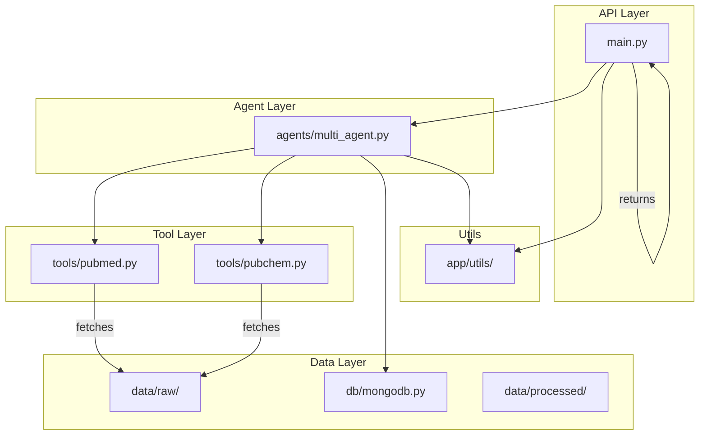
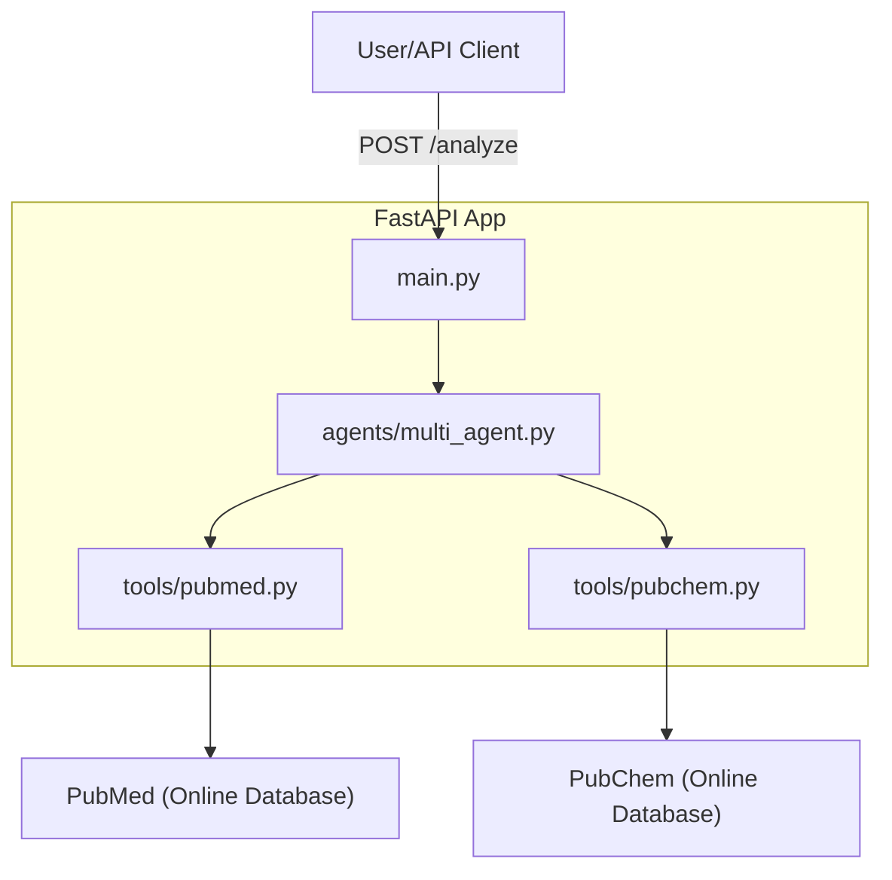

## 🧩 Modular Workflow

The following diagram shows the modular structure and workflow of the project:



* API Layer: Handles incoming requests and responses.
* Agent Layer: Orchestrates agent logic and task delegation.
* Tool Layer: Provides modular access to external data sources.
* Data Layer: Handles persistent and intermediate data storage.
* Utils: Shared utility functions used across modules.

# 🧠💊 Drug Discovery AI Assistant

 *(record a short Loom/GIF later)*

An end-to-end AI system for accelerating pharmaceutical research, demonstrating:

✅ **LLM Orchestration** (LangChain/CrewAI)  
✅ **Vector RAG** (MongoDB + VoyageAI)  
✅ **Production API** (FastAPI/Pydantic)  
✅ **Multi-Agent Systems**  


## 🏗️ Architecture

The following diagram shows the high-level architecture of the Drug Discovery AI Assistant:



* User/API Client sends a request to the FastAPI app.
* The app orchestrates agents and tools (CrewAI).
* Tools fetch data from online databases (PubMed, PubChem).

---

## 🚀 Quick Start
```bash
pip install -r requirements.txt
python app/main.py