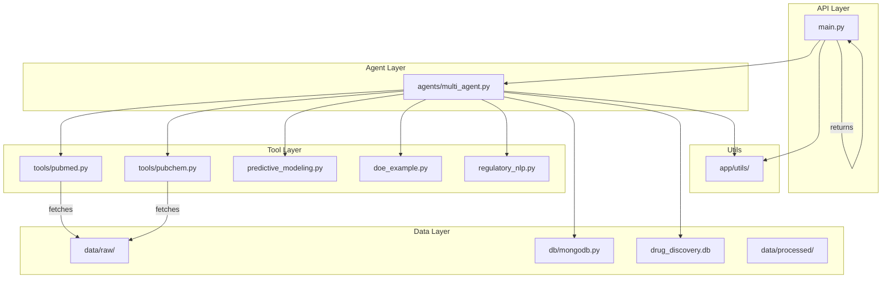
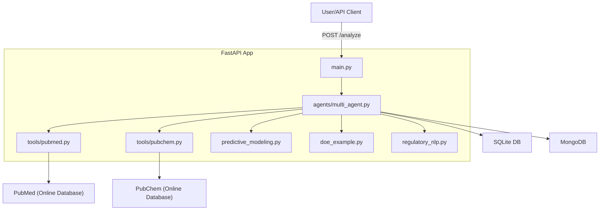

## 🧩 Modular Workflow

The following diagram shows the modular structure and workflow of the project:



* API Layer: Handles incoming requests and responses.
* Agent Layer: Orchestrates agent logic and task delegation.
* Tool Layer: Provides modular access to external data sources.
* Data Layer: Handles persistent and intermediate data storage.
* Utils: Shared utility functions used across modules.


# 🧠💊 Drug Discovery AI Assistant


## 🤖 System Overview: End-to-End AI for Drug Discovery & Formulation

This project is a modular, end-to-end AI platform for pharmaceutical research and drug development. It combines large language models (LLMs), machine learning, multi-agent orchestration, and data engineering to automate and accelerate key R&D workflows:

- **LLM RAG Agents:** Retrieval-Augmented Generation (RAG) agents use LLMs to synthesize up-to-date, context-aware answers from biomedical databases (e.g., PubMed, PubChem).
- **Multi-Agent Orchestration (CrewAI):** Specialized agents coordinate tasks such as literature mining, compound analysis, predictive modeling, DoE, and regulatory data parsing.
- **Predictive Modeling:** Machine learning models (scikit-learn) predict compound properties (e.g., solubility) from features, supporting formulation and screening.
- **Design of Experiments (DoE):** Automated generation of experimental design matrices for formulation optimization and QbD studies.
- **Regulatory/Clinical NLP:** Natural language processing tools extract insights from regulatory and clinical trial data.
- **Database Integration:** Supports both NoSQL (MongoDB) and SQL (SQLite) for flexible data storage and retrieval.
- **Production API (FastAPI):** Exposes all capabilities via a robust RESTful API for integration and automation.
- **Clear Documentation & Diagrams:** All workflows are documented with diagrams and code samples for reproducibility and collaboration.

**How it works:**
1. A user or API client submits a query (e.g., a compound name or experiment request) to the FastAPI endpoint.
2. The orchestrator agent (CrewAI) delegates subtasks to specialized agents and tools: literature search, compound property prediction, DoE, and regulatory data analysis.
3. Data is processed, modeled, and stored in MongoDB or SQLite as appropriate.
4. The system returns a synthesized, actionable response to the user or downstream application.

See `agents/multi_agent.py` and `app/main.py` for implementation details.

 *(record a short Loom/GIF later)*

This platform demonstrates:

✅ **LLM Orchestration & RAG** (LangChain/CrewAI, OpenAI, llama-index)  
✅ **Predictive Modeling** (scikit-learn)  
✅ **Design of Experiments** (DoE, pandas)  
✅ **Regulatory/Clinical NLP** (pandas, regex)  
✅ **Database Integration** (MongoDB, SQLite)  
✅ **Production API** (FastAPI/Pydantic)  
✅ **Multi-Agent Systems**


## 🚀 API Endpoints & Usage

### Base URL

```
http://127.0.0.1:8000
```

### Endpoints

#### `GET /`
Returns a welcome message to confirm the API is running.

**Example Response**
```json
{
	"message": "Drug Discovery AI API"
}
```

---

#### `POST /analyze`
Analyze a chemical compound using the AI agents.

**Request Body**
```json
{
	"compound": "aspirin"
}
```

**Example Curl**
```bash
curl -X POST "http://127.0.0.1:8000/analyze" -H "Content-Type: application/json" -d '{"compound": "aspirin"}'
```

**Example Response**
```json
{
	"compound": "aspirin",
	"properties": {
		"molecular_weight": 123.45,
		"formula": "C6H12O6",
		"iupac_name": "glucose"
	},
	"source": "mock"
}
```

---

### Interactive API Documentation

After starting the app, open your browser and visit:

- [Swagger UI](http://127.0.0.1:8000/docs) — interactive API docs and testing
- [ReDoc](http://127.0.0.1:8000/redoc) — alternative API documentation

---

### Example Screenshot

Add a screenshot of your Swagger UI here for reference:


[View API Docs](https://github.com/justin-mbca/drug-discovery-ai/blob/main/docs/api-docs.pdf)


---

### How to Run

1. Install dependencies:
	 ```bash
	 pip install -r requirements.txt
	 ```

2. Set your OpenAI API key in a `.env` file:
	 ```
	 OPENAI_API_KEY=sk-...
	 ```

3. Start the app:
	 ```bash
	 uvicorn app.main:app --reload
	 ```

4. Open [http://127.0.0.1:8000/docs](http://127.0.0.1:8000/docs) in your browser.

---

### Example Compounds

Try these in the `/analyze` endpoint:
- `"aspirin"`
- `"glucose"`
- `"ibuprofen"`
- `"acetaminophen"`

---

The following diagram shows the high-level architecture of the Drug Discovery AI Assistant:



* User/API Client sends a request to the FastAPI app.
* The app orchestrates agents and tools (CrewAI).
* Tools fetch data from online databases (PubMed, PubChem).

---

## 🆕 Additional Features

### 1. Predictive Modeling (scikit-learn)
Train a machine learning model to predict compound properties (e.g., solubility) from features.

**Example:**
```python
from sklearn.ensemble import RandomForestRegressor
from sklearn.model_selection import train_test_split
from sklearn.metrics import mean_squared_error
import pandas as pd

df = pd.read_csv('data/compound_features.csv')
X = df.drop('solubility', axis=1)
y = df['solubility']
X_train, X_test, y_train, y_test = train_test_split(X, y, test_size=0.2)
model = RandomForestRegressor()
model.fit(X_train, y_train)
preds = model.predict(X_test)
print("MSE:", mean_squared_error(y_test, preds))
```

**Sample Output:**
```
MSE: 0.14592400000000008
```

### 2. SQL/Database Integration (SQLite)
Store and query compound or experiment data using SQLite.

**Example:**
```python
import sqlite3
conn = sqlite3.connect('drug_discovery.db')
c = conn.cursor()
c.execute('''CREATE TABLE IF NOT EXISTS compounds (id INTEGER PRIMARY KEY, name TEXT, property REAL)''')
c.execute("INSERT INTO compounds (name, property) VALUES (?, ?)", ("aspirin", 123.45))
conn.commit()
for row in c.execute("SELECT * FROM compounds"):
    print(row)
conn.close()
```

**Sample Output:**
```
(1, 'aspirin', 123.45)
```

### 3. Design of Experiments (DoE)
Generate a factorial design matrix for formulation experiments using pure Python and pandas.

**Example:**
```python
import pandas as pd
import itertools
levels_A = [0, 1, 2]  # Excipient A: low, medium, high
levels_B = [0, 1, 2]  # Excipient B: low, medium, high
factorial_design = list(itertools.product(levels_A, levels_B))
df = pd.DataFrame(factorial_design, columns=['Excipient_A', 'Excipient_B'])
print(df)
```

**Sample Output:**
```
   Excipient_A  Excipient_B
0            0            0
1            0            1
2            0            2
3            1            0
4            1            1
5            1            2
6            2            0
7            2            1
8            2            2
```

### 4. Regulatory/Clinical Data Workflow (NLP)
Parse and analyze regulatory or clinical trial summaries for keywords (e.g., FDA) using pandas and regex.

**Example:**
```python
import pandas as pd
import re
df = pd.read_csv('data/clinical_trials.csv')
df['has_fda'] = df['summary'].apply(lambda x: bool(re.search(r'FDA', x, re.I)))
print(df[['trial_id', 'has_fda']])
```

**Sample Output:**
```
   trial_id  has_fda
0         1     True
1         2     True
2         3     True
3         4    False
```

---

## 🧩 Feature Integration Summary

| Feature                | Role in Workflow                                      | Feeds Into/Depends On                |
|------------------------|-------------------------------------------------------|--------------------------------------|
| FastAPI API            | Entry point for all requests                          | Orchestrator agent                   |
| CrewAI Orchestration   | Delegates tasks to agents/tools                       | All specialized modules              |
| PubMedTool             | Retrieves literature                                  | Compound analysis, regulatory review |
| PubChemTool            | Fetches compound data                                 | Predictive modeling, DoE             |
| Predictive Modeling    | Predicts properties for compounds                     | DoE, formulation optimization        |
| DoE                    | Designs experiments for formulation                   | Uses compound data/model predictions |
| Regulatory/Clinical NLP| Extracts insights from regulatory/clinical documents  | Compliance, reporting                |
| MongoDB/SQLite         | Stores all data and results                           | All modules                          |

This table shows how each module fits into the overall workflow and how they interact, making the system modular, extensible, and easy to understand.