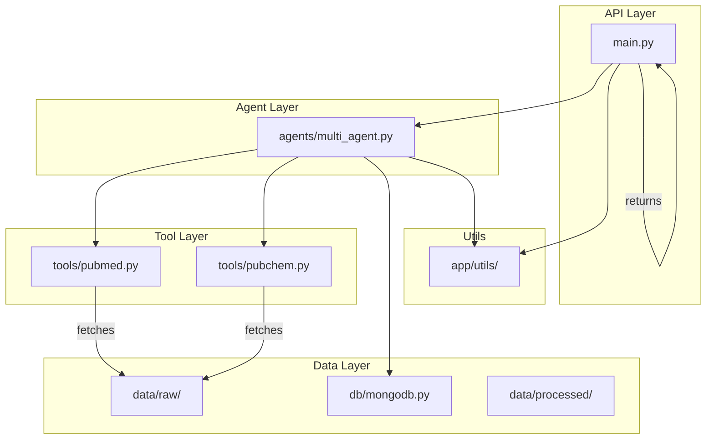
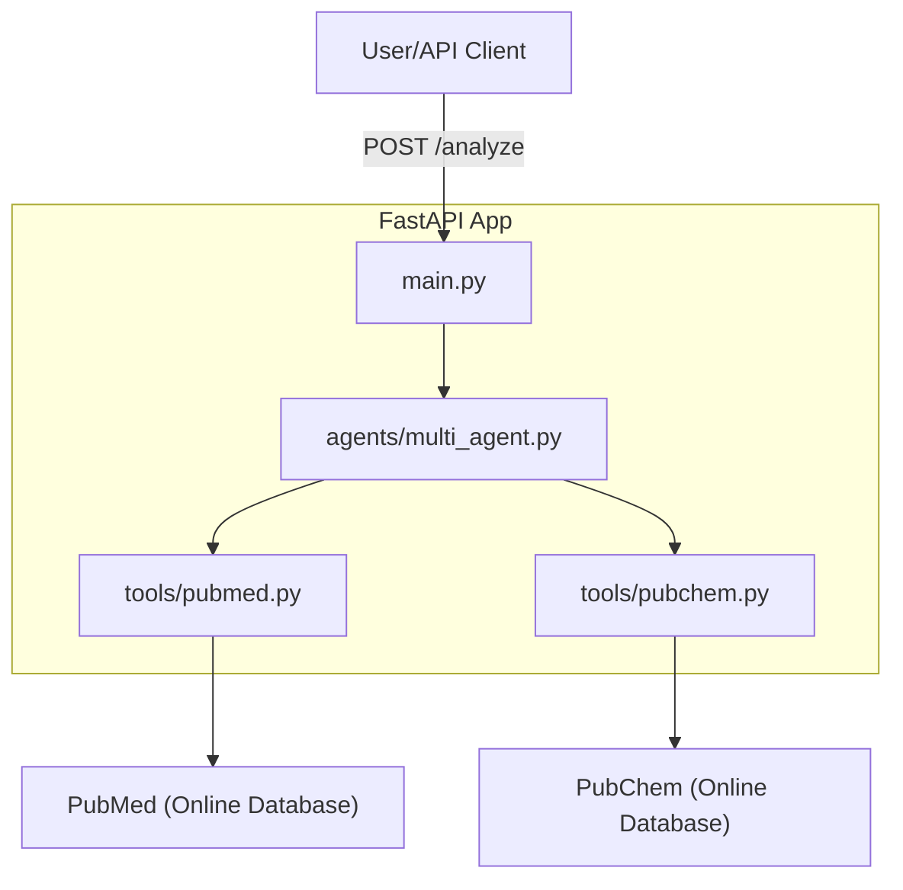

## 🧩 Modular Workflow

The following diagram shows the modular structure and workflow of the project:



* API Layer: Handles incoming requests and responses.
* Agent Layer: Orchestrates agent logic and task delegation.
* Tool Layer: Provides modular access to external data sources.
* Data Layer: Handles persistent and intermediate data storage.
* Utils: Shared utility functions used across modules.


# 🧠💊 Drug Discovery AI Assistant

## 🤖 System Overview: LLM RAG Agents & Multi-Agent Orchestration

This project implements an end-to-end LLM-powered system for accelerating pharmaceutical research, leveraging Retrieval-Augmented Generation (RAG) agents and multi-agent workflows:

- **LLM RAG Agents:** The core agents use Retrieval-Augmented Generation (RAG) to combine large language model reasoning with real-time retrieval from biomedical databases (e.g., PubMed, PubChem). This enables up-to-date, context-aware answers for drug discovery tasks.
- **CrewAI Multi-Agent Orchestration:** CrewAI coordinates multiple specialized agents, each responsible for a distinct part of the workflow (e.g., literature search, compound lookup, synthesis). Agents communicate and delegate tasks to maximize research efficiency.
- **Vector Database (MongoDB + VoyageAI):** Retrieved documents and embeddings are stored in MongoDB, with VoyageAI providing vector search capabilities for fast, relevant retrieval.
- **Production API (FastAPI):** The system exposes its capabilities via a FastAPI application, allowing programmatic access to multi-agent LLM workflows for integration with other tools or user interfaces.

**How it works:**
1. A user or API client submits a query (e.g., a compound name) to the FastAPI endpoint.
2. The orchestrator agent (CrewAI) delegates subtasks to RAG agents, which retrieve and synthesize information from external sources using custom tools.
3. Retrieved data is embedded and stored in MongoDB for efficient future access.
4. The system returns a synthesized, context-rich response to the user.

See `agents/multi_agent.py` and `app/main.py` for implementation details.

 *(record a short Loom/GIF later)*

An end-to-end AI system for accelerating pharmaceutical research, demonstrating:

✅ **LLM Orchestration** (LangChain/CrewAI)  
✅ **Vector RAG** (MongoDB + VoyageAI)  
✅ **Production API** (FastAPI/Pydantic)  
✅ **Multi-Agent Systems**  


## 🚀 API Endpoints & Usage

### Base URL

```
http://127.0.0.1:8000
```

### Endpoints

#### `GET /`
Returns a welcome message to confirm the API is running.

**Example Response**
```json
{
	"message": "Drug Discovery AI API"
}
```

---

#### `POST /analyze`
Analyze a chemical compound using the AI agents.

**Request Body**
```json
{
	"compound": "aspirin"
}
```

**Example Curl**
```bash
curl -X POST "http://127.0.0.1:8000/analyze" -H "Content-Type: application/json" -d '{"compound": "aspirin"}'
```

**Example Response**
```json
{
	"compound": "aspirin",
	"properties": {
		"molecular_weight": 123.45,
		"formula": "C6H12O6",
		"iupac_name": "glucose"
	},
	"source": "mock"
}
```

---

### Interactive API Documentation

After starting the app, open your browser and visit:

- [Swagger UI](http://127.0.0.1:8000/docs) — interactive API docs and testing
- [ReDoc](http://127.0.0.1:8000/redoc) — alternative API documentation

---

### Example Screenshot

Add a screenshot of your Swagger UI here for reference:

```
[View API Docs (PDF)](docs/api-docs.pdf)
```

---

### How to Run

1. Install dependencies:
	 ```bash
	 pip install -r requirements.txt
	 ```

2. Set your OpenAI API key in a `.env` file:
	 ```
	 OPENAI_API_KEY=sk-...
	 ```

3. Start the app:
	 ```bash
	 uvicorn app.main:app --reload
	 ```

4. Open [http://127.0.0.1:8000/docs](http://127.0.0.1:8000/docs) in your browser.

---

### Example Compounds

Try these in the `/analyze` endpoint:
- `"aspirin"`
- `"glucose"`
- `"ibuprofen"`
- `"acetaminophen"`

---

The following diagram shows the high-level architecture of the Drug Discovery AI Assistant:



* User/API Client sends a request to the FastAPI app.
* The app orchestrates agents and tools (CrewAI).
* Tools fetch data from online databases (PubMed, PubChem).

---

## 🚀 Quick Start
```bash
pip install -r requirements.txt
python app/main.py