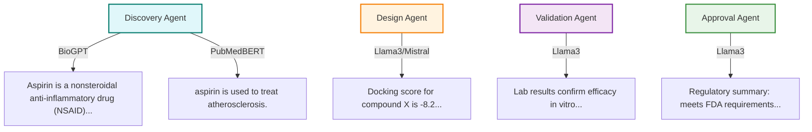

# Supported LLM Models

All agents use a local LLM served by Ollama by default. The system is designed to be modular, allowing you to select the best model for your use case, including both general-purpose and biomedical-specific LLMs.

**How to change the model:**
- Pass the desired model name to the agent constructor, e.g.:
	```python
	agent = DiscoveryAgent(model="mistral")
	agent = DesignAgent(model="phi3")
	```
- To see all available models, run:
	```bash
	ollama list
	```
- To add a new model, run:
	```bash
	ollama pull <model_name>
	```

## Recommended Models

- `llama3` (default): Latest generation of Meta's Llama models, strong general-purpose performance for summarization, reasoning, and scientific tasks.
- `llama2`: Previous generation from Meta, smaller and faster than llama3, suitable for lightweight tasks but less capable for complex reasoning.
- `mistral`: Open-weight model focused on efficiency and speed, good for fast responses and smaller hardware.
- `phi3`: Microsoft’s compact model, designed for efficiency and strong performance on reasoning and code, suitable for resource-constrained environments.

## Biomedical Models

- `BioGPT`: Microsoft’s biomedical language model, trained on PubMed and biomedical text. Excellent for drug/life sciences tasks, and small enough for local inference. **BioGPT is highly recommended for biomedical text generation, summarization, and question answering.**
- `PubMedBERT`: Biomedical BERT model, trained on PubMed abstracts and full text. Very efficient for local biomedical NLP, especially for fill-mask, classification, and entity recognition tasks. **PubMedBERT is ideal for extracting biomedical knowledge and masked word prediction.**

> **When to prefer BioGPT or PubMedBERT over general LLMs?**
>
> - Use **BioGPT** or **PubMedBERT** when your task is biomedical, pharmaceutical, or life sciences focused (e.g., drug properties, disease mechanisms, literature summarization, biomedical Q&A).
> - These models are trained on domain-specific corpora (PubMed, biomedical literature), so they produce more accurate, relevant, and trustworthy results for scientific and medical queries than general LLMs like Llama or Mistral.
> - For general reasoning, code, or non-biomedical tasks, Llama3, Llama2, Mistral, or Phi3 may be more appropriate.

**Note:** BioGPT and PubMedBERT are not available in Ollama by default. To use them, install via Hugging Face Transformers and update your agent code to use the Hugging Face pipeline for inference. See `test_biomed_llm.py` for a working example.

You can experiment with these and other models available in the [Ollama library](https://ollama.com/library) or on [Hugging Face](https://huggingface.co/models) to find the best fit for your workflow.

Refer to the [Ollama documentation](https://ollama.com/library) and [Hugging Face model hub](https://huggingface.co/models) for more details on available models and their capabilities.

# Agent Enhancements (August 2025)

All core agents (Discovery, Design, Validation, Approval) have been modernized and enhanced:

- Integrated real data sources and tools for each agent (PubMed, PubChem, AlphaFold, Docking, QSAR, Lab, Clinical, Regulatory).
- Added LLM summarization to every agent using a local Ollama LLM (configurable model, e.g., llama3).
- Prompts are now readable, context-rich, and tailored to each agent's domain (compound info, literature, docking, QSAR, lab, clinical, regulatory, etc.).
- Streaming LLM output is fully accumulated for complete, high-quality responses.
- Exception handling is robust and specific.
- LLM model is configurable via each agent's constructor for easy experimentation.
- Code is modular, maintainable, and ready for further extension.

# Recent Enhancements (August 2025)

The drug discovery AI workflow has been significantly improved:

- Integrated real PubMed, PubChem, and AlphaFold tools for literature, compound, and structure data.
- Replaced mock LLM with a local Ollama LLM (configurable model, e.g., llama3).
- LLM prompt engineering now produces detailed, context-aware compound summaries.
- Prompts include readable PubChem info, relevant PubMed IDs, and explicit summary instructions.
- Streaming LLM output is fully accumulated for complete, high-quality responses.
- Exception handling is more robust and specific.
- LLM model is configurable via the agent constructor for easy experimentation.
- Code is modular, maintainable, and ready for further extension.

## 🧩 Modular Workflow

The following diagram shows the modular structure and workflow of the project:


* API Layer: Handles incoming requests and responses.
* Agent Layer: Orchestrates agent logic and task delegation.
* Tool Layer: Provides modular access to external data sources and AI models.
* Data Layer: Handles persistent and intermediate data storage.
* Utils: Shared utility functions used across modules.


# 🧠💊 Drug Discovery AI Assistant


## 🤖 System Overview: LLM RAG Agents & Multi-Agent Orchestration

This project is an end-to-end AI platform for accelerating pharmaceutical research, built on modular Retrieval-Augmented Generation (RAG) agents and a multi-agent workflow:

- **LLM RAG Agents:** Specialized agents combine large language model reasoning with real-time retrieval from biomedical databases (e.g., PubMed, PubChem), enabling up-to-date, context-aware answers for drug discovery tasks.
- **Multi-Agent Orchestration:** A custom orchestrator coordinates multiple agents, each handling a distinct stage of the workflow (e.g., literature search, compound design, validation, approval). Agents communicate and delegate tasks to maximize research efficiency.
- **Vector Database (MongoDB + VoyageAI):** Retrieved documents and embeddings are stored in MongoDB, with VoyageAI providing vector search for fast, relevant retrieval.
- **Production API (FastAPI):** The system exposes its capabilities via a FastAPI application, enabling programmatic access to the multi-agent workflow for integration with other tools or user interfaces.

**Workflow Overview:**
1. A user or API client submits a query (e.g., a compound name) to the FastAPI endpoint.
2. The orchestrator agent delegates subtasks to specialized RAG agents, which retrieve and synthesize information from external sources using modular tools.
3. Retrieved and generated data are embedded and stored in MongoDB for efficient future access.
4. The system returns a synthesized, context-rich response to the user.

## 🖼️ Example Workflow & LLM Outputs (Mermaid Diagram)



*This diagram shows each agent, the LLM/model used, and a sample output for that stage. Biomedical models (BioGPT, PubMedBERT) are used in Discovery; general LLMs (Llama3/Mistral) are used in other stages.*

See `agents/multi_agent.py` and `app/main.py` for implementation details.

 *(record a short Loom/GIF later)*

An end-to-end AI system for accelerating pharmaceutical research, demonstrating:

✅ **LLM Orchestration** (LangChain/CrewAI)  
✅ **Vector RAG** (MongoDB + VoyageAI)  
✅ **Production API** (FastAPI/Pydantic)  
✅ **Multi-Agent Systems**  


## 🏗️ Architecture

The following diagram shows the updated high-level architecture of the Drug Discovery AI Assistant:


* User/API Client sends a request to the FastAPI app.
* The app orchestrates agents and tools.
* Each agent delegates to specialized tools for data retrieval and analysis.
* Tools fetch data from online databases or perform computations.
* All results and intermediate data are stored in MongoDB.

## 🧑‍🔬 Agent Descriptions & AI Methods

| Agent            | Description                                                                 | AI Methods/Models Used                |
|------------------|-----------------------------------------------------------------------------|--------------------------------------|
| Discovery Agent  | Searches biomedical literature and databases to identify potential drug candidates. | LLM (RAG), PubMed, PubChem           |
| Design Agent     | Designs and optimizes candidate compounds based on discovery results.             | LLM, AlphaFold, Docking, QSAR        |
| Validation Agent | Validates candidate compounds using lab and clinical data.                        | LLM, LabTool, ClinicalTool           |
| Approval Agent   | Assesses regulatory requirements and prepares documentation for approval.         | LLM, RegulatoryTool                  |

---

## 🚀 Quick Start
```bash
pip install -r requirements.txt
uvicorn app.example_main:app --reload
```

## 🧪 Example API Endpoints

Test the full workflow (all stages):

```
GET /full_workflow?query=BACE1
```

Test individual stages:

```
GET /discovery?query=BACE1
GET /design?compound=aspirin
GET /validation?candidate=aspirin
GET /approval?candidate=aspirin
```


---

## 🏁 What Next?

Now that you have the Drug Discovery AI Assistant running locally, here are some suggested next steps:

- **Customize Agents:** Modify or extend the agent logic in `agents/` to add new tools, change prompts, or integrate additional data sources.
- **Integrate New Models:** Try other LLMs from Ollama or Hugging Face by updating the agent `model` parameter, or add your own domain-specific models.
- **Experiment with Prompts:** Tune the prompts for each agent to improve the quality and relevance of LLM outputs for your specific research needs.
- **Deploy the API:** Use FastAPI’s deployment options to run the system in production (e.g., with Docker, on a cloud VM, or behind a reverse proxy).
- **Connect a Frontend:** Build a web or desktop UI to interact with the API, visualize results, or manage workflows.
- **Scale Up:** Integrate with more advanced vector databases, distributed compute, or workflow orchestration tools for larger-scale research.
- **Contribute:** Open issues or pull requests to help improve the project, or share your use cases and feedback!


---

## 🌐 Connecting a Frontend UI

You can build a user-friendly frontend to interact with the Drug Discovery AI API. Here are some options and examples:

### 1. Simple Web Client (HTML/JS)

You can use a basic HTML/JavaScript page to send requests to the FastAPI backend:

```html
<form id="queryForm">
	<input type="text" id="query" placeholder="Enter compound name">
	<button type="submit">Submit</button>
</form>
<pre id="result"></pre>
<script>
document.getElementById('queryForm').onsubmit = async function(e) {
	e.preventDefault();
	const q = document.getElementById('query').value;
	const res = await fetch(`http://127.0.0.1:8000/full_workflow?query=${encodeURIComponent(q)}`);
	document.getElementById('result').textContent = await res.text();
};
</script>
```

### 2. Streamlit App (Python)

Create a simple Streamlit UI for local use:

```python
import streamlit as st
import requests

st.title("Drug Discovery AI Assistant")
query = st.text_input("Enter compound name:")
if st.button("Submit"):
		response = requests.get(f"http://127.0.0.1:8000/full_workflow?query={query}")
		st.write(response.text)
```

### 3. Advanced Web UI (React, Next.js, etc.)

For a modern, user-friendly experience, build a custom frontend using React, Next.js, or similar frameworks. Example (React fetch call):

```javascript
fetch('http://127.0.0.1:8000/full_workflow?query=BACE1')
	.then(res => res.json())
	.then(data => setResult(data));
```

You can design interactive dashboards, result visualizations, and workflow management features tailored to your needs.


---

## 🧪 Step-by-Step Example: Discovering a Drug Candidate

Here’s how you can use the Drug Discovery AI pipeline for a real-world drug discovery scenario:

**Goal:** Identify and evaluate new drug candidates for Alzheimer’s disease (target: BACE1)

### 1. Start the Backend API
```bash
uvicorn app.example_main:app --reload
```

### 2. Submit a Query (e.g., via browser or curl)
```bash
curl "http://127.0.0.1:8000/full_workflow?query=BACE1"
```
Or use the interactive docs at [http://127.0.0.1:8000/docs](http://127.0.0.1:8000/docs)

### 3. Review the Output
- **Discovery Agent:** Summarizes BACE1’s role in Alzheimer’s, retrieves relevant compounds and literature.
- **Design Agent:** Suggests and evaluates new compound designs, docking scores, and predicted properties.
- **Validation Agent:** Simulates lab/clinical validation, summarizes findings.
- **Approval Agent:** Generates a regulatory summary for the candidate.

### 4. Iterate and Refine
- Try different targets or compounds (e.g., "aspirin", "tau protein").
- Adjust agent prompts or models for more specific results.
- Integrate your own data or tools for deeper analysis.

### 5. (Optional) Build a Frontend
- Use the provided examples to create a web UI for easier interaction and visualization.

