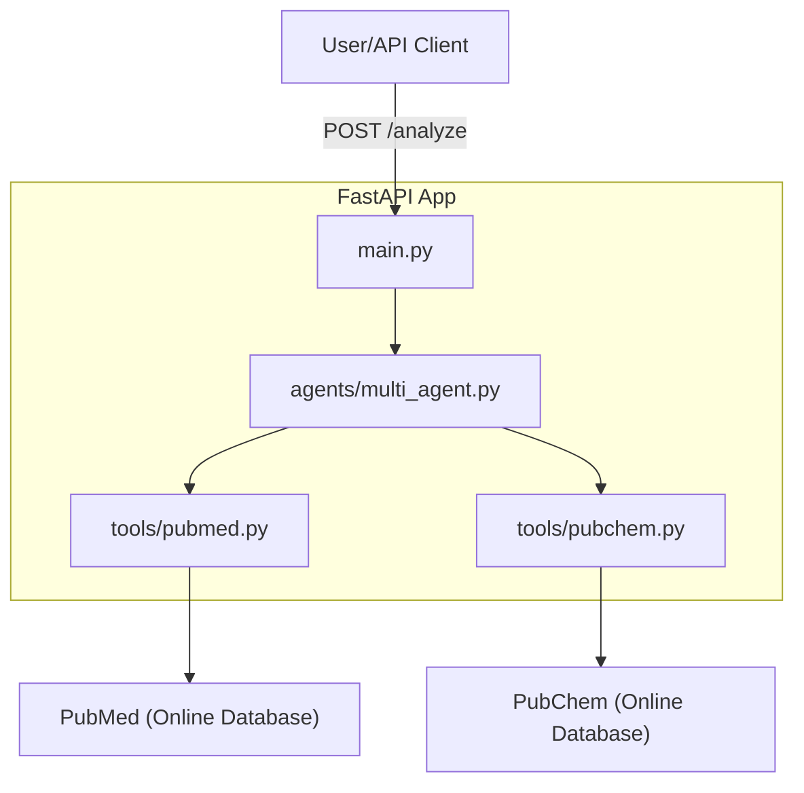

```mermaid
graph TD;
    User[User/API Client]
    subgraph FastAPI App
        Main[main.py]
        Crew[agents/multi_agent.py]
        PubMedTool[tools/pubmed.py]
        PubChemTool[tools/pubchem.py]
    end
    PubMed["PubMed (Online Database)"]
    PubChem["PubChem (Online Database)"]

    User -->|POST /analyze| Main
    Main --> Crew
    Crew --> PubMedTool
    Crew --> PubChemTool
    PubMedTool --> PubMed
    PubChemTool --> PubChem
```
